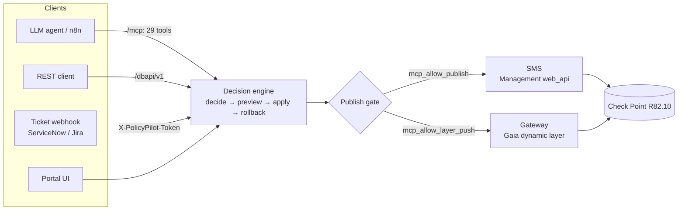

<div align="center">

# PolicyPilot

### Agentic Check Point access automation

*Turn a plain-language access request into the correct, first-match-safe policy change — applied to a real
**R82.10 management server** or pushed straight to the **gateway** as a dynamic layer — and drivable by an
LLM agent over MCP.*


</div>

---

PolicyPilot connects to a **real Check Point R82.10 Management Server** (and/or gateways) and does exactly
what its API account is permitted to — least privilege. You describe the access you want; the engine computes
the **minimal** change, places it **first-match-safe**, previews it, and applies it on approval, with
one-click rollback. No hand-editing rulebases, and no guessing where a rule belongs.

> **One sentence, one rule.** *"Allow 10.1.1.50 to the DNS servers and publish"* becomes a correct Accept
> rule on your SMS — reusing existing objects, placed above the right deny, and published — whether the
> sentence comes from an engineer in the portal, a ServiceNow ticket, or an LLM agent over MCP.

---

## Contents

- [Why PolicyPilot](#why-policypilot)
- [Architecture](#architecture)
- [How a request becomes a rule](#how-a-request-becomes-a-rule)
- [The decision engine](#the-decision-engine)
- [Access-rule columns](#access-rule-columns)
- [Interfaces](#interfaces)
- [Users and access control](#users-and-access-control)
- [Quick start](#quick-start)
- [Configuration](#configuration)
- [Deployment](#deployment)
- [Security](#security)
- [Testing](#testing)
- [Documentation](#documentation)

---

## Why PolicyPilot

Firewall change management is where good intentions meet a 3,000-rule policy. The request ("let this app
reach that database") is simple; getting it *right* is not:

- **First-match ordering is unforgiving.** A new Accept placed below a broader Drop never fires; placed above
  a narrower rule, it can shadow it. Correct placement requires reasoning about every rule in between.
- **Object sprawl.** Teams recreate the same host, network, and service objects under slightly different
  names, and rulebases accrete near-duplicate rules nobody dares delete.
- **"Does X already have access?"** is genuinely hard to answer by eye once groups, negation, disabled rules,
  inline layers, and `Any` cells are involved — yet it decides whether you even need a change.
- **Change is risky and rarely reversible in one click.**

PolicyPilot treats the rulebase as something to *reason about*, not just edit. It decides whether the access
already exists, can be granted by widening an existing rule, or needs a brand-new rule; computes the exact,
first-match-safe insertion point; reuses existing objects instead of minting duplicates; previews the change
before anything is written; and records an inverse op-list so any published change can be rolled back. The
same engine answers the read-only question ("can X reach Y today?") that decides whether a change is needed
at all.

---

## Architecture

One decision engine, four ways to drive it, two rails to apply the result — all over a single authenticated
surface.



The same brain drives **two ways to apply a change** — both fully agent-drivable over the same `/mcp`
endpoint (29 tools total: 21 management + 8 dynamic-layer, mcp-scope key as `Authorization: Bearer`):

| Rail | What it does | How | Publish gate |
|---|---|---|---|
| **Management access policy — SMS** | Create / widen an access rule in the policy rulebase, then **publish**. | Management Web API (`web_api`) | `mcp_allow_publish` |
| **Dynamic Layers — Gateway** | Author an access rulebase and push it **straight to the gateway** as a dynamic layer, out-of-band of SmartConsole. | Gaia API (`set-dynamic-content`, sk182252) | `mcp_allow_layer_push` |

The two rails carry **separate publish gates** — enabling agent writes to the SMS does not enable a live
gateway push, and vice versa. Dry-run and the built-in `mock` target are always allowed. The SMS engine
deliberately treats the dynamic layer as **out-of-band** (skips it from matching), so the two rails are
complementary halves of access automation, never overlapping.

---

## How a request becomes a rule

Every surface funnels into the same two steps: **decide** (read-only) then **apply** (gated). A decision
reports whether the access exists today, what the minimal change is, and — in the portal — the before/after
rule and its placement.

**1. Decide** — preview what would happen, writing nothing:

```bash
curl -sX POST https://policypilot.example.com/dbapi/v1/access/decide \
  -H "Authorization: Bearer $POLICYPILOT_API_KEY" \
  -H "Content-Type: application/json" \
  -d '{"server_id": 1, "layer": "Network",
       "source": "10.1.1.50", "destination": "DNS-Servers", "service": "domain-udp"}'
```

```jsonc
{
  "ok": true,                       // the check ran (NOT "is it allowed")
  "outcome": "create",              // no_op | widen | create | review
  "currently_allowed": false,       // is the access permitted today?
  "answer": "No — 10.1.1.50 cannot reach DNS-Servers on domain-udp today. A new Accept rule would be created above the cleanup rule.",
  "reason": "No rule in 'Network' permits this flow; the nearest deny is the cleanup rule at the bottom."
}
```

**2. Apply** — stage the change and (if the publish gate is on) commit it, idempotently:

```bash
curl -sX POST https://policypilot.example.com/dbapi/v1/access/apply \
  -H "Authorization: Bearer $POLICYPILOT_API_KEY" \
  -H "Content-Type: application/json" \
  -d '{"server_id": 1, "layer": "Network",
       "source": "10.1.1.50", "destination": "DNS-Servers", "service": "domain-udp",
       "publish": true, "ticket_id": "INC0012345", "idempotency_key": "inc0012345"}'
```

```jsonc
{ "ok": true, "outcome": "create", "applied": true, "published": true,
  "target_rule": { "uid": "…" }, "summary": "outcome=create … published" }
```

The same call over MCP is `decide_access(server_id="SMS", layer="Network", source="10.1.1.50",
destination="DNS-Servers", service="domain-udp")`; the agent relays the `answer` and, on approval, calls
`apply_access(..., publish=true)`. Any published change is reversible with `revert_change`.

---

## The decision engine

- **Reuse / widen / create** — determines whether the access already exists (`no_op`), can be granted by
  widening an existing rule or the group it references (`widen`), or needs a new rule (`create`). When it
  cannot be sure (opaque or application cells it will not guess at), it returns `review`.
- **First-match-safe placement** — inserts above the right deny, below the right stealth/cleanup, in the
  right section — so the new rule is neither shadowed nor shadowing. Handles ordered and inline layers,
  sections, and the cleanup rule.
- **Reuse-only object resolution** — resolves a source / destination / service to an *existing* Check Point
  object via dedicated commands, deduped by IP value rather than name, so it never blindly creates
  duplicates. Domains and dynamic objects are created if missing; access-roles, security-zones, and
  updatable objects are reuse-only.
- **Discovery ("did you mean")** — resolves a plain phrase (a service, application, time object, data-type,
  access-role, security-zone, gateway, VPN community, or UserCheck message) to the real Check Point object:
  it auto-matches a unique hit, otherwise returns ranked candidates for the agent or user to choose from.
- **Zero-trust by identity** — reason in identity space, not just IPs: "does the *finance role* reach the
  *DMZ zone*?" resolves an Identity-Awareness access-role and a security-zone and evaluates against the real
  objects.
- **Revoke, not just grant** — `remove_access` withdraws an existing allow (disabling it when it can prove
  the rule is sole and exact, otherwise inserting a Drop above). Blocking traffic outright is a Drop / Reject
  via `apply_access` — a distinct operation from revoking.
- **One-click rollback** — every published change records its inverse op-list; `revert_change` restores the
  prior state. Writes are idempotent: a retry with the same key replays the first result instead of
  double-committing.
- **Provably conservative analysis** — `analyze_policy` flags a rule as shadowed only when it can prove it,
  and abstains on opaque / application cells rather than guessing.

See the **[access-automation white paper](docs/access-automation-whitepaper.md)** for the relation algebra,
the deny split, placement anchors, and the exact `web_api` sequence per outcome.

---

## Access-rule columns

The engine writes **every** access-rule column, not just source / destination / service. Setting any of the
advanced columns makes the request *restricted*: the engine creates a precise rule **above** a broad Accept
so the new condition actually takes effect under first-match (never a false reuse). Restriction objects are
**reuse-only** — they must already exist on the SMS; the engine will not invent a time object or a limit.

| Column | Accepts | Notes |
|---|---|---|
| **Source / Destination** | IP, CIDR, `Any`; or a typed object: Domain, Access-role, Dynamic object, Updatable object, Security zone | Each kind is its own match space (identity vs IP) |
| **Service** | TCP / UDP / SCTP by port; ICMP / RPC / DCE-RPC / GTP / Other / service-group by name; `Any` | Matched to an existing object by protocol kind |
| **Application** | Application / Site by name | Typo-tolerant "did you mean" |
| **Action** | Accept · Drop · Reject · Ask · Inform · Apply Layer | Apply Layer diverts into an inline layer |
| **Action Settings (UserCheck)** | A UserCheck object — a block message (Drop / Reject) or an Ask / Inform prompt, with frequency / confirm | Matches the SmartConsole "Action Settings" dialog |
| **Content** | Data-type objects, with direction (any / upload / download) and optional negate | Reuse-only |
| **Time** | Time objects / groups | Reuse-only |
| **Install-on** | Gateways / targets | Reuse-only |
| **VPN** | Communities (including the built-in `All_GwToGw`) | Reuse-only |
| **Limit** | A bandwidth **rate** object (e.g. `Upload_10Mbps`) + Enable Identity Captive Portal | A rate, not a volume/quota; Accept / Ask / Inform |
| **Track · Name · Comments · Enabled** | Edited on an existing rule via `amend_access_rule` | |

---

## Interfaces

### MCP server — 29 tools

Both rails are exposed as **29 tools** an LLM agent (n8n, Claude Desktop, Cursor, VS Code, any MCP client)
calls over `/mcp` with an mcp-scope key. Two ready-made n8n workflows ship in `docs/`:
the **[management access agent](docs/policypilot-management-agent.json)** and the
**[dynamic-layer agent](docs/policypilot-dynamic-layer-agent.json)**. With the **Autopilot** preset, one
sentence ending *"…and publish the changes"* resolves, applies, and publishes in a single turn on the
management rail. In-app onboarding lives at `/mcp-guide`.

<details>
<summary><b>The full tool catalog</b> (21 management + 8 dynamic-layer)</summary>

**Management / SMS rail (21)**

| Tool | Purpose |
|---|---|
| `list_management_servers` | List saved SMS connections |
| `list_access_layers` | List access layers on a server |
| `decide_access` | Preview a decision (read-only) — the primary reasoning tool |
| `apply_access` | Stage / dry-run a change and publish (gated) |
| `remove_access` | Revoke an existing allow (disable-if-sole-and-exact, else Drop above) |
| `amend_access_rule` | Edit columns on an existing rule |
| `list_changes` | List recorded changes (the rollback journal) |
| `revert_change` | Roll back a published change via its inverse op-list |
| `correlate_service` | Resolve a service / protocol phrase to a CP object |
| `correlate_application` | Resolve an application / site phrase |
| `correlate_time` | Resolve a time phrase to a time object |
| `correlate_content` | Resolve a data-type (content) phrase |
| `correlate_user_check` | Resolve a UserCheck interaction / block message |
| `correlate_access_role` | Resolve an identity phrase to an access-role |
| `correlate_zone` | Resolve a security-zone phrase |
| `correlate_limit` | Resolve a bandwidth phrase to a limit (rate) object |
| `correlate_gateway` | Resolve a gateway / install-on target |
| `correlate_vpn` | Resolve a VPN community |
| `summarize_layer` | High-level summary of an access layer |
| `analyze_policy` | Shadowed / overly-permissive insights (conservative) |
| `coverage_lookup` | Terraform / Ansible coverage for a CP object |

**Dynamic-layer rail (8)**

| Tool | Purpose |
|---|---|
| `list_gateways` | List saved gateways (push targets) |
| `list_dynamic_layers` | List dynamic layers |
| `get_dynamic_layer` | Read one dynamic layer's rulebase (portal copy) |
| `add_dynamic_rule` | Add a rule to a dynamic layer (edit only) |
| `remove_dynamic_rule` | Remove a rule from a dynamic layer |
| `push_dynamic_layer` | Push a dynamic layer to a gateway (gated; a full replace) |
| `fetch_dynamic_layer` | Read a gateway's live dynamic-layer content via Gaia |
| `import_dynamic_layer` | Import a gateway's live layer into a portal layer to edit + push |

</details>

### REST API

The same engine at `/dbapi/v1` for any HTTP client (api-scope key auth), mirroring the tools across both
rails — including `/access/decide`, `/access/apply`, `/access/correlate/*`, `/gateways`, and
`/dynamic-layers/*`. Self-documented in the in-app **PolicyPilot API** page and the portal OpenAPI at
`/docs`. See the [decide / apply examples above](#how-a-request-becomes-a-rule).

### Ticket webhook

A ServiceNow / Jira / any webhook becomes a Check Point rule, authenticated with the `X-PolicyPilot-Token`
header (common vendor field aliases — ServiceNow `u_*` / `number`, Jira `key` — are accepted):

```jsonc
{
  "ticket_id": "INC0012345",
  "server_id": 1,
  "layer": "Network",
  "source": "10.1.1.50",
  "destination": "DNS-Servers",
  "service": "domain-udp",
  "apply": true          // omit or false for a dry-run; publish still needs the gate
}
```

Optional write-back posts the outcome to a callback URL (SSRF-guarded). Redelivery-safe via the same
idempotency store as the API.

### Portal UI

A macOS-style desktop (dock + draggable app windows): review a decision, see the before/after rule and its
placement, and apply on approval — plus a live **API explorer** (Swagger) at `/api-explorer` for testing
Management / Gaia API calls directly, a **System** app for live health, and per-user desktop layouts.

> The **[MCP-agent QA battery](docs/mcp-agent-qa.md)** is a standing set of one-sentence "…and publish"
> prompts that exercise every tool, outcome, and column — the demo script and the regression check in one.

---

## Users and access control

PolicyPilot is multi-user with granular, least-privilege roles. Each account is an **Admin** (all
permissions, superuser) or a **Standard** user carrying individual capabilities; "view" is implicit for any
active user. New users can self-register and land `pending` until an admin approves them; inactive
(`pending` / `disabled`) accounts cannot authenticate. Password reset is by email (SMTP-gated), with an
admin fallback. Enforced consistently across the portal, MCP, and REST.

| Capability | Key | Default | Grants |
|---|---|---|---|
| Preview decisions | `preview` | on | Run decisions / previews (read-only reasoning) |
| Apply changes | `apply` | off | Stage and dry-run a change against the SMS session |
| Publish to management | `publish` | off | Commit staged changes to the SMS (irreversible) |
| Export IaC / Gaia | `export` | on | Generate Terraform / Ansible / clish and Gaia config |
| Manage users | `manage_users` | off | Create, approve, edit, reset, disable other users |
| Change settings | `settings` | admin-only | Portal settings + secrets — not grantable to a Standard user |

---

## Quick start

```bash
python3 -m venv .venv && source .venv/bin/activate
pip install -r requirements.txt
export PILOT_ADMIN_PASSWORD='<choose-a-strong-password>'   # else a random one is printed at startup
export PILOT_SESSION_SECRET=$(openssl rand -base64 32)
uvicorn app.main:app --reload
```

Open <http://localhost:8000>, sign in as `admin`, then:

1. **Management Servers → add** your R82.10 SMS (host + a least-privilege API account).
2. **Access automation** → describe an access request → preview the decision (no-op / widen / create) → apply.
3. **MCP for agents** (`/mcp-guide`) → mint an mcp-scope key and connect n8n or your agent.

> The MCP protocol layer requires the official **`mcp`** SDK (installed from your Check Point Artifactory, not
> public PyPI). Until it is present the `/mcp` endpoint is simply absent — the rest of PolicyPilot is
> unaffected, and the REST API still exposes the same tools.

---

## Configuration

Environment variables bootstrap the deployment; **most secrets are also settable from the Settings UI**
(encrypted at rest, no redeploy), where the portal value takes precedence.

| Variable | Purpose | Default |
|---|---|---|
| `PILOT_ADMIN_PASSWORD` | Seed admin password | random (printed at startup) |
| `PILOT_SESSION_SECRET` | Signs session cookies | — (set in prod) |
| `PILOT_ENCRYPTION_KEY` | AES-256-GCM key for saved credentials / secrets | derived from the session secret if unset |
| `PILOT_BASE_URL` | External base URL (links, callbacks) | `http://localhost:8000` |
| `PILOT_DATABASE_URL` | Database URL | `sqlite:///./data/policypilot.db` |
| `PILOT_TRUSTED_PROXY_HOPS` | Trusted `X-Forwarded-For` hops behind a proxy | `0` (set `1` behind Traefik / Caddy) |
| `PILOT_WEBHOOK_TOKEN` | Ticket-webhook auth token | — |
| `PILOT_WEBHOOK_SERVER_IDS` | Server ids the webhook may target | blank = all |
| `PILOT_SERVICENOW_*` | ServiceNow instance / credentials for write-back | — |

> **Set `PILOT_ENCRYPTION_KEY` independently and persist it.** If it is unset it derives from the session
> secret, so rotating the session secret (or losing the derived key) orphans every stored credential and
> secret. See [DEPLOY.md](DEPLOY.md).

---

## Deployment

Build from the **`Dockerfile`**, expose port **8000**, add a domain (Traefik handles Let's Encrypt TLS),
mount **`/data`** for the SQLite database, and set the `PILOT_*` variables above. The build bakes the git
SHA, surfaced in the About menu and at `GET /version` (`build`, `built_at`) so you can confirm exactly which
commit is live. `GET /healthz` and `GET /readyz` are for liveness / readiness probes; `GET /dbapi/v1/conformance`
is a read-only self-check that the agent surface is wired and safe. Full guide: **[DEPLOY.md](DEPLOY.md)**;
post-deploy smoke test: **[docs/live-validation.md](docs/live-validation.md)**.

---

## Security

- **Login-gated portal; scoped, revocable API keys.** Machine access uses named, scoped (`mcp` / `webhook` /
  `api`) keys with optional expiry and an optional read-only capability, shown once and SHA-256-hashed at
  rest. Per-key rate limiting caps a runaway agent.
- **TLS to the SMS / gateway is always verified.** Self-signed lab boxes are handled by cert pinning
  (trust-on-first-use or a pasted certificate); verification is never disabled.
- **Credentials encrypted at rest** with AES-256-GCM (`PILOT_ENCRYPTION_KEY`).
- **Publish is opt-in.** An agent cannot reach live policy unless an admin enables the per-rail gate;
  otherwise every apply is a dry-run (validate and discard). The two rails gate independently.
- **Defense in depth.** Parameterized queries throughout; PBKDF2 portal logins; anti-clickjacking / nosniff /
  HSTS headers; SSRF-guarded webhook callbacks; a spoofed-`X-Forwarded-For` throttle bypass closed via
  trusted-proxy-hop resolution; governance events (in-app + webhook) on every committed change, metadata only.
- Use a **least-privilege API account** on the SMS — PolicyPilot only does what it is permitted to.

---

## Testing

```bash
pytest -q          # 842 tests, all green
```

The suite covers the relation algebra and decision outcomes, placement, every access-rule column, the
correlate / discovery family, RBAC enforcement, the MCP and REST surfaces, idempotency, and rollback. A pure
offline smoke test of the decision engine runs with `python3 -m app.services.access_automation`.

---

## Documentation

- **[docs/mcp-n8n.md](docs/mcp-n8n.md)** — connect n8n / an LLM agent over MCP, plus the REST API.
- **[docs/policypilot-management-agent.json](docs/policypilot-management-agent.json)** — ready-made n8n agent for the management access rail.
- **[docs/policypilot-dynamic-layer-agent.json](docs/policypilot-dynamic-layer-agent.json)** — ready-made n8n agent for the dynamic-layer rail.
- **[docs/mcp-agent-qa.md](docs/mcp-agent-qa.md)** — the one-sentence "…and publish" QA battery (demo + regression).
- **[docs/live-validation.md](docs/live-validation.md)** — the 15-minute post-deploy smoke test for both rails against a real lab.
- **[docs/access-automation-whitepaper.md](docs/access-automation-whitepaper.md)** — how the engine reasons about a rulebase.
- **[docs/integrations/access-automation.md](docs/integrations/access-automation.md)** — the ticket-to-rule flow.
- **[docs/integrations/management-export.md](docs/integrations/management-export.md)** — pull and export policy as Terraform / Ansible / `mgmt_cli`.
- **[docs/integrations/gaia-export.md](docs/integrations/gaia-export.md)** — export a gateway's Gaia OS config.
- **[docs/integrations/dynamic-layers.md](docs/integrations/dynamic-layers.md)** — the gateway-direct (dynamic-layer) rail.
- **[docs/settings.md](docs/settings.md)** — secrets, API keys, RBAC, and the SMS session cache.
- **[CHANGELOG.md](CHANGELOG.md)** — release history.

---

<div align="center">
<sub>Validated against a live Check Point R82.10 Management Server. "Check Point" is a trademark of Check Point Software Technologies Ltd.</sub>
</div>
